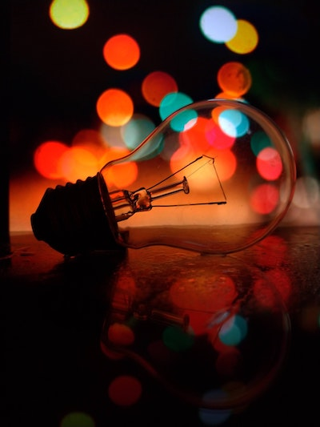

# Level1 Code

```python
print("hello world")
```

# Level 1 list

- test
- test

## Inline code

This is code:

`print("hello world")`

## Level 2 Incremental

::: incremental

- Turn off alarm
  - Turn on alarm
- Get out of bed
  - Get in bed

:::

## Level 2 list

1. Eat eggs
2. Drink coffee

## Level 2 list

1. Eat eggs
   1. Drink coffee
   2. Eat a cake
2. Drink coffee
   1. Eat a cake
   2. Drink coffee

# Level 1 Empty

## Level 2

next slide has no header

---


---

## Equations

$$\sum_{i=1}^{n} x_{i}y_{i}$$

## With Notes

This slide has a note.

::: notes

This is my note.

- It can contain Markdown
- like this list

:::

---

```{.jsx data-line-numbers="|4,8-11|15" data-id="code-animation"}
// long code
import React, { useState } from 'react';

function Example() {
  const [count, setCount] = useState(0);

  return (
    <div>
      <p>You clicked {count} times</p>
      <button onClick={() => setCount(count + 1)}>
        Click me
      </button>
    </div>
  );
}
```

---

## This slide has columns

::: columns

:::: column
left
::::

:::: column
right
::::

:::

---

::: columns

:::: column

::::

:::: column
This is the second column.

The image to the left is 600px wide.

::::

:::

---

::: columns

:::: column
This is the left column.

The image to the right is 400x553px.
::::

:::: column

::::

:::

---

## {data-background-image="assets/kaung-myat-min-bCAOV2Sg7Es-unsplash.jpg"}

::: {.r-fit-text style="color: white"}

No image in beamer!

:::

---

::: columns

:::: column

{height=90%}

::::

:::: column

| **Item** | **Option** |
| :------- | :--------: |
| Item 1   |  Option 1  |
| Item 2   |  Option 2  |

::::

:::

## Incremental

Incremental list:

::: incremental

- Turn off alarm
- Get out of bed
- Eat eggs
- Drink coffee

:::

## Video

<video controls width="400px"
data-src="assets/mov/Bog-AV-noise-m18dB-SNR.mp4">
</video>

This slide has a video that only shows in html output.
